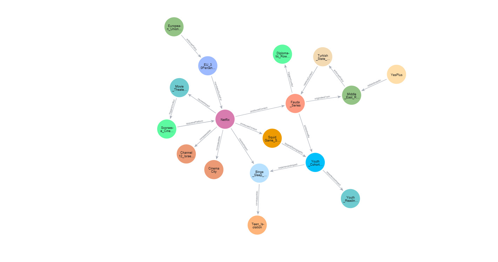
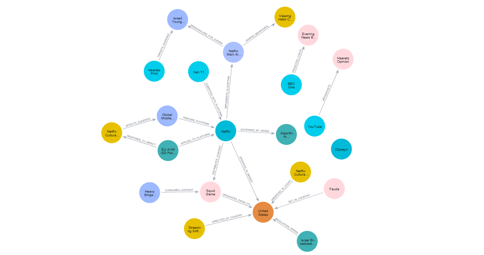
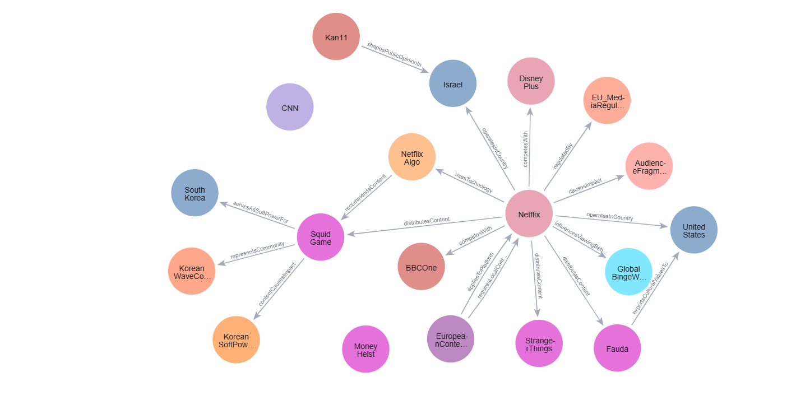

#  LLM-Driven Knowledge Graphs: Comparative Analysis & Query Benchmarking

An academic research repository evaluating Generative AI models (Gemini, Perplexity, and ChatGPT) across ontology engineering, Knowledge Graph construction, Neo4j implementation, structured graph queries versus AI free-text responses, and Wikidata SPARQL benchmarking within the domain of streaming media and traditional outlets.


---

## 📌 Project Overview

This project explores the capabilities and limitations of Large Language Models in automated ontology engineering and Knowledge Graph (KG) construction. Using the domain of global streaming platforms versus traditional media as a testbed, the study investigates how different LLMs handle structural taxonomic constraints, how structured database queries (**Neo4j Cypher**) compare to natural language AI responses, and how closed-world graph models contrast with open-world public data ecosystems (**Wikidata SPARQL**). 

The complete project documentation and implementation details are divided into the main academic research report and accompanying appendices.

---

## 📁 Repository Structure

```text
streaming-media-knowledge-graph-llm/
│── Knowledge Graph Final Project - Netflix.pdf # Main academic research report (Parts 1-4)
│── Appendices - Netflix.pdf                  # Comprehensive appendices (Models, Cypher, AI Free-Text, SPARQL)
│── Gemini_KG.ttl                             # Gemini Baseline Ontology & Triples (Appendix A)
│── Perplexity_KG.ttl                         # Perplexity Fine-Tuned Ontology & Triples (Appendix B)
│── ChatGPT_KG.ttl                            # ChatGPT Expanded Ontology & Triples (Appendix C)
│── Gemini_KG.png                             # Gemini Knowledge Graph Topology (Figure 3.1)
│── Perplexity_KG.png                         # Perplexity Knowledge Graph Topology (Figure 3.2)
│── ChatGPT_KG.png                            # ChatGPT Knowledge Graph Topology (Figure 3.3)
└── README.md                                 # Detailed Repository Architecture & Research Findings

```

---

## 🧬 Ontological Architecture & Tool Comparison

As documented in **Part 1 & Part 2** of `Knowledge Graph Final Project - Netflix.pdf`, the study evaluates three distinct GenAI architectures built from a standardized initial prompt to model the cultural, geopolitical, and behavioral impacts of global streaming platforms versus traditional media. 

Each model was required to enforce strict ontological criteria: a 3-level IS-A class hierarchy, at least 20 classes and sub-classes, 20 Data Properties, 20 Object Properties, 20 specific instances, and 20 Knowledge Graph triples, with execution results comparing across the three architectures as follows:

* **Gemini (Model 1):** Maintained precise single-turn adherence to all numeric and taxonomic constraints without scope creep, producing a balanced, ready-to-implement baseline knowledge graph containing exactly 23 classes and sub-classes organized across 5 core main branches.
  
* **Perplexity / Sonar 2 (Model 2):** Highlighted the necessity of iterative prompt engineering. Its initial generation comprised 23 classes and sub-classes structured across 7 main branches, but suffered from a *Predicate Redundancy Error* (repeatedly reusing `platformDistributesContent`). Since a robust knowledge graph requires diverse relationships to properly model multi-dimensional cultural, geopolitical, and behavioral impacts, this structural limitation was successfully resolved using a targeted negative constraint in a second prompt ("do not repeat any object property") to ensure relational richness
  
* **ChatGPT (Model 3):** Generated an expansive, research-grade knowledge graph exceeding 70 classes and sub-classes across 7 main branches, featuring advanced OWL constraints, 35 instances, and 50 triples. However, this exhibited *over-generation*, significantly going beyond the scope (incorporating unrequested institutional actors and concepts), depth (reaching 4 levels deep instead of the required 3), and strict structural boundaries originally requested in the standardized initial prompt.
---

## 🔍 Query Retrieval: Structured Cypher vs. AI Free-Text

As detailed in **Part 3** of `Knowledge Graph Final Project - Netflix.pdf` and demonstrated in **Appendices D & E** of `Appendices - Netflix.pdf`, multi-hop competency questions, such as evaluating *"Identifying geographic regions, governing authorities, and regulatory policies enforcing censorship or quotas on streaming services"*, were evaluated across two parallel channels, manifesting either as **deterministic matches** (where graph paths and semantic text fully align) or **zero records / bounded precision** (where structural gaps cause Neo4j to return empty results while the AI maintains strict factual boundaries). Since each AI tool generated a unique ontology with its own structural topology, the corresponding Cypher queries were adapted to match each model's distinct schema:

* **Scenario A: Successful Multi-Hop Traversal (Deterministic Match)**  
  When an ontology is precisely structured, queries execute continuous multi-hop traversals across interconnected nodes (A -> B -> C -> D). In Gemini's model, this is demonstrated through its four-node path:  
  `Geographic_Region` -> `State_Censorship` -> `Content_Item` -> `Media_Platform`  
  Neo4j successfully traverses this explicit path, yielding exact, deterministic records with zero deviation that align seamlessly with the AI's semantic free-text synthesis.

* **Scenario B: Path Disconnection (Zero Records & Bounded Precision)**  
  When an ontology suffers from structural gaps or disjoint schema paths where the multi-hop chain fails to bridge to the target node (`Country` -> `GovernanceAndPolicy` -> missing direct content-blocking links), the traversal breaks. This results in zero records returned by the closed-world Neo4j database. However, the AI's free-text synthesis demonstrates robust contextual understanding by pivoting to available platform-level directives present in the knowledge graph (e.g., `EU_AVMSD_Policy`) rather than hallucinating fictitious banned content items.

  > *Summary:* While closed-world Neo4j queries provide strict mathematical determinism, they remain vulnerable to structural schema gaps, whereas AI free-text synthesis bridges these gaps safely through contextual grounding.
---

## 🌍 Wikidata SPARQL Benchmarking

As explored in **Part 4** of `Knowledge Graph Final Project - Netflix.pdf` and **Appendix F** of `Appendices - Netflix.pdf`, closed-world findings were benchmarked against the open-world Wikidata ecosystem via the Wikidata Query Service. To establish structural alignment with the Neo4j analyses, the core research goals and competency questions were mapped and executed across three distinct SPARQL queries:

* **1. Cultural & Geopolitical Distribution (Query 1):**  
  * *Research Goal / Competency Focus:* Identify international television series originating outside the United States that are distributed globally by platforms like Netflix.  
  * *Wikidata Execution:* Evaluated via SPARQL Query 1 (`wdt:P750` filtered by `wd:Q907311`), examining international series like *Squid Game* (South Korea) or *Money Heist* (Spain).  
  * *Comparative Perspective:* While closed Neo4j models frame international content through the lens of strategic corporate distribution and national soft power, open-world Wikidata treats them as objective bibliographic entities defined by rigid administrative attributes (country of origin `wdt:P495` and original language `wdt:P364`).

* **2. Institutional Governance & Regulation (Query 2):**  
  * *Research Goal / Competency Focus:* Retrieve formal regulatory directives and market frameworks governing online platforms.  
  * *Wikidata Execution:* Evaluated via SPARQL Query 2, targeting formal EU legislative acts such as the Audiovisual Media Services Directive (`AVMSD 2010`) and `GDPR` (`wd:Q56856283` and `wd:Q1172506`).  
  * *Comparative Perspective:* While closed graphs model policies like the EU AVMSD as active regulatory friction and industry power struggles, Wikidata catalogs them as static, formal legislative legal acts issued by supranational authorities from a compliance-oriented standpoint.

* **3. Behavioral & Health Impact (Query 3):**  
  * *Research Goal / Competency Focus:* Map behavioral concepts and physiological conditions related to modern digital media consumption.  
  * *Wikidata Execution:* Evaluated via SPARQL Query 3, mapping standardized medical and sociological taxonomies for `binge-watching` (`wd:Q15094181`) and `sleep disorder` (`wd:Q177190`).  
  * *Comparative Perspective:* While Neo4j models behavioral outcomes like binge-watching or sleep disruption as direct causal consequences inflicted by platform algorithms on specific demographic cohorts, Wikidata treats them as disconnected, standardized medical and sociological taxonomical nodes devoid of corporate links.

> *Summary:* Closed-world Knowledge Graphs excel at narrative-driven, subjective, and causal modeling of controversy and societal harm, whereas open-world knowledge bases (Wikidata) provide an objective, consensus-driven structural backbone that validates real-world facts.
---

## 📊 Visualizations Highlights

### Figure 3.1: Gemini Knowledge Graph
<p align="center">
  
</p>
<p align="center"><em>20 nodes, 20 relationships (Focusing on Platform Content, Censorship, and Behavioral Impacts).</em></p>

### Figure 3.2: Perplexity Knowledge Graph
<p align="center">
  
</p>
<p align="center"><em>22 nodes, 20 relationships (Focusing on Recommendation Algorithms and Regulatory Policies).</em></p>

### Figure 3.3: ChatGPT Knowledge Graph
<p align="center">
  
</p>
<p align="center"><em>21 core nodes, 19 key relationships (Focusing on Global Distribution and Cultural Impact).</em></p>

## 🛠️ Tech Stack & Dependencies

* **Graph Database:** Neo4j (Cypher Query Language)
* **Semantic Web:** RDF, OWL, Turtle (`.ttl`)
* **GenAI Frameworks:** Gemini, Perplexity, ChatGPT (Prompt engineering & iterative feedback workflows)
* **Data Ecosystems:** Wikidata SPARQL Query Service

---

## 👤 Author

**Kerem Bar**

*Master's Student in Information Sciences (Information Technology Specialization)*

```

```
